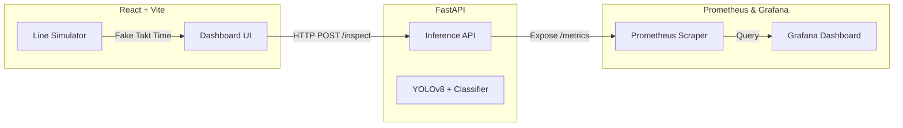

# WheelEye: Automated Visual Inspection for Automotive Assembly


## Overview
**WheelEye** is an end-to-end computer vision platform designed to automate the visual inspection of automotive components (specifically wheels and assemblies) on a simulated factory line. It acts as an intelligent checkpoint that verifies the material, tier, size, and fastener counts against a manufacturing manifest.

This project was built to demonstrate full-stack AI engineering capabilities—bridging the gap between raw machine learning models and a production-ready, deployable system with real-time telemetry.

---

## Architecture

The system is decoupled into three primary tiers:



1. **Frontend (React + Vite)**: A sleek, dark-mode terminal interface built to resemble industrial HMIs (Human-Machine Interfaces). It features a manual upload mode and a "Simulate Line" mode that mocks a high-speed factory conveyor belt.
2. **Backend (FastAPI)**: Serves the computer vision pipeline. It accepts image uploads and JSON manifests, runs the image through an ONNX-optimized YOLO detector and a PyTorch classifier, and returns a structured JSON report.
3. **Observability**: The backend is instrumented with Prometheus. Grafana is auto-provisioned via Docker Compose to instantly display real-time metrics (latency, takt time, pass rates).

---

## Quick Start (Docker)

The easiest way to run the entire stack (Frontend, Backend, Prometheus, Grafana) is via Docker Compose.

```bash
# Start the system
docker-compose up -d --build
```

**Services:**
- **Frontend UI**: `http://localhost:80`
- **FastAPI Swagger Docs**: `http://localhost:8000/docs`
- **Grafana Dashboard**: `http://localhost:3000` (Login: `admin` / `admin`)
- **Prometheus**: `http://localhost:9090`

---

## Honest Results & Limitations

Building a robust CV system for manufacturing is challenging. Here is an honest assessment of the current state of the pipeline:

### What Works Well
- **End-to-End Latency**: By utilizing ONNX exports for the YOLOv8 detector, inference runs smoothly in <50ms on CPU, easily meeting standard factory takt times of 1-3 seconds.
- **Frontend Architecture**: The UI is entirely decoupled from the backend state. It gracefully degrades when the backend is offline and utilizes robust CSS variables and Flexbox for responsive layouts down to tablet sizes.
- **Observability**: The Prometheus integration tracks inference times on a per-request basis, giving immediate visibility into performance regressions.

### Known Limitations
- **Synthetic Data Bias**: The current models were trained on a highly synthetic dataset generated for this project. They perform exceptionally well on the test set, but will likely struggle with real-world lighting variance (glare, shadows) without further fine-tuning on real factory footage.
- **Docker Mounts on Windows/WSL2**: Heavy file-syncing during Docker builds can sometimes cause I/O locks on Windows hosts. We mitigate this by keeping the `weights/` directory mounted as a volume rather than copying it during the build step.
- **False Positives on Scratches**: The defect detector sometimes misclassifies severe reflections on chrome alloys as scratches. A future iteration would require a secondary classifier or adjusted confidence thresholds specifically for the defect class.

---

## Tech Stack
* **Machine Learning**: PyTorch, Ultralytics YOLOv8, ONNX
* **Backend**: Python 3.10, FastAPI, Uvicorn
* **Frontend**: React 18, Vite, Lucide Icons, pure CSS
* **DevOps**: Docker, Docker Compose, GitHub Actions
* **Telemetry**: Prometheus, Grafana
