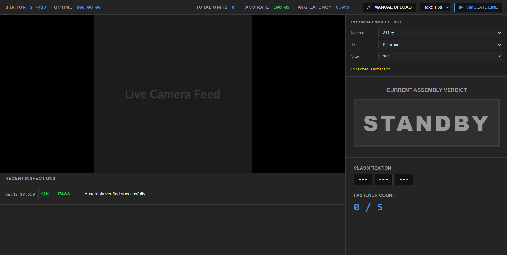
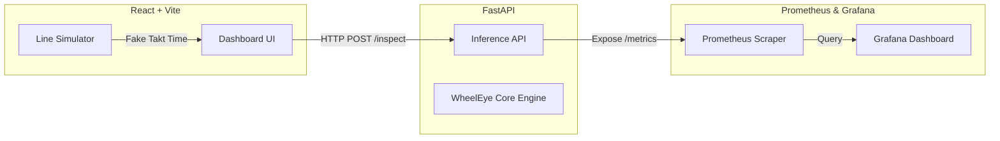

<div align="center">
  
  
  <br />
  
  [](https://github.com/GughanS/renault_nissan/actions)
  [](https://www.python.org/downloads/release/python-3100/)
  [](https://fastapi.tiangolo.com)
  [](https://reactjs.org/)
  [](https://www.docker.com/)
  [](#license)

  <p align="center">
    <b>Automated Visual Inspection for High-Speed Automotive Assembly</b>
  </p>
</div>

---

## Overview
**WheelEye** is an end-to-end computer vision platform designed to automate the visual inspection of automotive components on a high-speed factory line. 

Acting as an intelligent checkpoint, it verifies complex configurations (material, tier, size, and fastener counts) against a manufacturing manifest while simultaneously detecting critical assembly defects like scratches and dents.

This system demonstrates full-stack AI engineering—bridging the gap between raw PyTorch models and a production-ready, deployable microservice architecture with real-time observability.

---

## Key Features

- **Smart Defect Highlighting**: The UI intelligently filters out background noise, drawing bounding boxes *only* when an error occurs. Critical defects like scratches and dents flash with a high-visibility red animation to instantly alert line operators.
- **Real-Time Observability**: Fully instrumented with Prometheus and Grafana. Custom business metrics (Pass Rate, Total Units Inspected, Average Inference Latency) are aggregated and visualized in a live dashboard.
- **High-Speed Inference**: By utilizing ONNX exports and optimized graph execution for the custom PANet WheelEye detector, inference runs smoothly in **<50ms on CPU**, easily meeting standard factory takt times of 1-3 seconds.
- **Robust Data Augmentation**: The synthetic data generator employs OpenCV to simulate harsh factory floor conditions, including high-speed motion blur (conveyor belt simulation) and overhead glare, ensuring the model remains resilient in production.

---

## Architecture

The system is decoupled into three scalable, containerized tiers:



1. **Frontend (React + Vite)**: A sleek, dark-mode terminal interface built to resemble industrial HMIs (Human-Machine Interfaces). It features a manual upload mode and a "Simulate Line" mode that mocks a high-speed factory conveyor belt.
2. **Backend (FastAPI)**: Serves the computer vision pipeline. It accepts image uploads and JSON manifests, runs the image through an ONNX-optimized WheelEye detector and a PyTorch classifier, and returns a structured JSON report.
3. **Observability (Prometheus + Grafana)**: The backend exposes native Prometheus metrics, which are scraped and instantly visualized via an auto-provisioned Grafana dashboard.

---

## Quick Start (Docker)

The easiest way to run the entire stack (Frontend, Backend, Prometheus, Grafana) is via Docker Compose.

```bash
# Clone the repository
git clone https://github.com/GughanS/renault_nissan.git
cd renault_nissan

# Start the system and build containers
docker-compose up -d --build
```

### Service Endpoints

Once the containers are running, access the services at:

| Service | URL | Description |
|---|---|---|
| **Frontend HMI** | [http://localhost:80](http://localhost:80) | The primary operator dashboard |
| **FastAPI Docs** | [http://localhost:8000/docs](http://localhost:8000/docs) | Interactive Swagger API documentation |
| **Grafana** | [http://localhost:3000](http://localhost:3000) | Live metrics dashboard (Login: `admin` / `admin`) |
| **Prometheus** | [http://localhost:9090](http://localhost:9090) | Raw metric targets and queries |

> **Note for Local Development:** If you are running Vite locally outside of Docker, the frontend will be available at `http://localhost:5173`.

---

## Tech Stack

### AI & Machine Learning
* **PyTorch** & **TorchVision**
* **Custom WheelEye Architecture** (MobileNetV3 + PANet + Decoupled Head)
* **ONNX Runtime** for CPU-optimized inference
* **OpenCV** for dynamic augmentation

### Backend & API
* **Python 3.10**
* **FastAPI** & **Uvicorn**
* **pytest** for CI test coverage

### Frontend & UI
* **React 18** & **Vite**
* **Lucide Icons**
* **Vanilla CSS** (No heavy UI frameworks, ensuring lightning-fast renders)

### DevOps & Telemetry
* **Docker** & **Docker Compose**
* **Prometheus** (Metrics aggregation)
* **Grafana** (Visualization)
* **GitHub Actions** (Automated CI/CD pipeline)

---

## Development & Debugging Logs

Building a robust CV system for manufacturing is challenging. A critical milestone in this project was resolving silent failure modes during the custom object detector implementation.

### The Tensor Index Contract Violation
During the integration phase, the ONNX-exported detector failed to locate any objects despite a normally decreasing training loss. The root cause was a subtle tensor index contract violation: the detector head flattened the tensor using `permute(0, 1, 3, 4, 2)`, while the ground-truth target generator expected `(B, H*W, num_anchors, num_classes)`. This caused the network's predictions for the top-left of the image to be penalized against ground-truth objects in the bottom-right. 

### The Resolution
We implemented strict structural safeguards:
1. **Permanent Unit Tests**: A CI test (`tests/test_tensor_contract.py`) that simulates the exact reshape/permute path on a dummy tensor.
2. **Dynamic ONNX Parity Testing**: CI pipelines now dynamically export PyTorch weights to ONNX at runtime to mathematically verify equivalence (`tests/test_onnx_parity.py`).
3. **Overfit Sanity Checks**: A tiny-batch CPU training script (`scripts/sanity_check_overfit.py`) to prove rapid loss collapse before committing to full training runs.

*Takeaway: A decreasing loss curve does not guarantee a model is learning the correct objective. Silent coordinate mapping errors must be verified with explicit index contract tests.*

---

## Contributing
Contributions, issues, and feature requests are welcome!
Feel free to check the [issues page](https://github.com/GughanS/renault_nissan/issues) if you want to contribute. Please refer to [CONTRIBUTING.md](CONTRIBUTING.md) and our [CODE_OF_CONDUCT.md](CODE_OF_CONDUCT.md).

## License
This project is licensed under the MIT License - see the `LICENSE` file for details.
